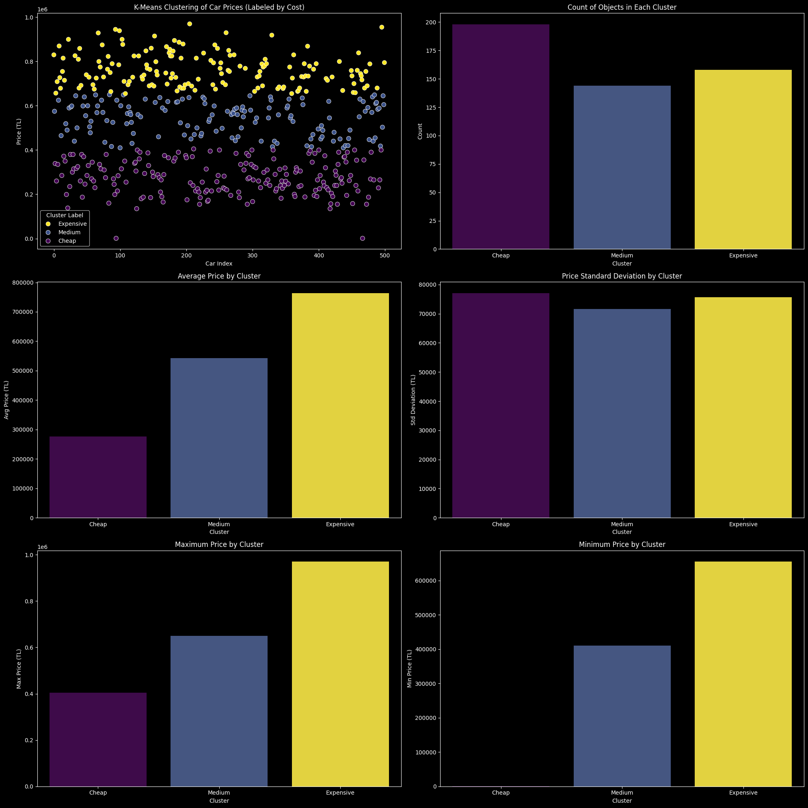

## Veri Hazırlığı ve Temizleme Süreci

### **Veri Setinin Yüklenmesi**

- **Kod**: `data = pd.read_excel("./fiat_cars_raw.xlsx", index_col=0)`
- **Açıklama**: Veri seti, `pd.read_excel` kullanılarak Excel dosyasından (`"fiat_cars_raw.xlsx"`) yüklenir. İlk sütun, DataFrame’in indeks sütunu olarak ayarlanır (`index_col=0`), böylece her satırın benzersiz bir şekilde tanımlanması sağlanır ve veri üzerinde gereksiz sütunlar yer almaz.

### **Sütun İsimlerinin Yeniden Düzenlenmesi**

- **Kod**:
    
    ```python
    data = data.rename(
      columns = {
        'Motor Hacmi': 'Motor Hacmi (CC)',
        'Motor Gücü': 'Motor Gücü (HP)',
        'Ort. Yakıt Tüketimi': 'Ort. Yakıt Tüketimi (Litre)',
        'Yakıt Deposu': 'Yakıt Deposu (Litre)',
        'Price': 'Price (TL)'
      }
    )
    
    ```
    
- **Açıklama**: Veri setindeki sütunlar daha anlaşılır ve tutarlı olması adına yeniden adlandırılır. Örneğin, `"Motor Hacmi"` sütunu `"Motor Hacmi (CC)"` olarak değiştirilir, böylece değerlerin hacim (CC) cinsinden olduğu belirtilir ve `"Price"` sütunu `"Price (TL)"` olarak değiştirilir, böylece değerlerin Türk Lirası (TL) cinsinden olduğu ifade edilir.

### **Eksik Verilerin İşlenmesi**

- **Kod**:
    
    ```python
    data_set_null_count = dict(data.isnull().sum())
    columns_to_drop = [column_name for column_name, null_count in data_set_null_count.items() if null_count > 100]
    columns_to_drop.remove("Ort. Yakıt Tüketimi (Litre)")
    data = data.drop(columns=columns_to_drop).reset_index().drop(columns=["index"])
    
    ```
    
- **Açıklama**:
    - Her bir sütundaki eksik değerlerin sayısı `data.isnull().sum()` ile hesaplanır ve sonuçlar `data_set_null_count` sözlüğünde saklanır.
    - 100'den fazla eksik değeri olan sütunlar, `columns_to_drop` listesine eklenir. Ancak `"Ort. Yakıt Tüketimi (Litre)"` sütunu, analiz için kritik olduğundan silinmekten çıkarılır.
    - Belirlenen sütunlar veri setinden çıkarılır ve sıfırdan düzgün bir indeksleme sağlanır.

### **Veri Tipi Dönüşümü**

- **Kod**:
    
    ```python
    data["İlan No"] = data["İlan No"].astype(int)
    data["Ort. Yakıt Tüketimi (Litre)"] = data["Ort. Yakıt Tüketimi (Litre)"].str.replace(',', '.').str.extract(r'(\\d.\\d?)').astype("Float32")
    data["Motor Hacmi (CC)"] = data["Motor Hacmi (CC)"].str.extract(r'(\\d+)').astype("Int64")
    data["Motor Gücü (HP)"] = data["Motor Gücü (HP)"].str.extract(r'(\\d+)').astype("Int64")
    data["Yakıt Deposu (Litre)"] = data["Yakıt Deposu (Litre)"].str.extract(r'(\\d+)').astype("Int64")
    data["Price (TL)"] = data["Price (TL)"].str.extract(r'(\\d+)').astype("Int64") * 1000
    data["Kilometre"] = data["Kilometre"].str.extract(r'(\\d+)').astype("Int64") * 1000
    
    ```
    
- **Açıklama**:
    - `"İlan No"` sütunu tamsayıya dönüştürülür çünkü bu sütun bir ilan numarasını temsil eder ve tam sayı olması gereklidir.
    - `"Ort. Yakıt Tüketimi (Litre)"`, `"Motor Hacmi (CC)"`, `"Motor Gücü (HP)"`, `"Yakıt Deposu (Litre)"`, `"Price (TL)"` ve `"Kilometre"` gibi string türündeki sütunlardaki sayılar temizlenir (örneğin, virgüller noktalarla değiştirilir) ve uygun sayısal türlere dönüştürülür (`Float32` veya `Int64`).
    - `"Price (TL)"` sütunundaki değerler 1000 ile çarpılır, böylece fiyatların Türk Lirası (TL) cinsinden doğru şekilde ifade edilmesi sağlanır.

### **Temizlenmiş Veriyi Kaydetme**

- **Kod**: `data.to_excel("./fiat_cars_cleaned.xlsx")`
- **Açıklama**: Temizlenmiş veri, `"fiat_cars_cleaned.xlsx"` adıyla yeni bir Excel dosyasına kaydedilir. Bu dosya, ileri analizler ve kullanım için hazır olur.

## Kümeleme ve Analiz

### **Veri Ölçekleme**

- **Kod**: `prices_scaled = StandardScaler().fit_transform(data[['Price (TL)']])`
- **Açıklama**: `Price (TL)` sütunu, `StandardScaler` kullanılarak ölçeklendirilir, böylece ortalama 0 ve standart sapma 1 olan bir dağılıma getirilir. Bu, KMeans kümeleme algoritmasının daha iyi sonuçlar üretmesini sağlar çünkü bu algoritma verinin ölçeğinden etkilenebilir.

### **KMeans Kümeleme**

- **Kod**:
    
    ```python
    kmeans = KMeans(n_clusters=3, random_state=0)
    data['Cluster'] = kmeans.fit_predict(prices_scaled)
    data[["Cluster", "Price (TL)"]].groupby('Cluster').mean().sort_values('Price (TL)')
    
    ```
    
- **Açıklama**:
    - 3 küme içeren bir KMeans modeli oluşturulur ve bu model, ölçeklendirilmiş fiyat verisine uygulanarak her araba için bir küme ataması yapılır.
    - `data['Cluster']` sütunu, her araba için küme numarasını içerir. Kümeleme sonuçları, her küme için ortalama fiyat hesaplanarak incelenir ve sıralanır.

### **Küme Merkezlerine Göre Küme Numaralarının Sıralanması**

- **Kod**:
    
    ```python
    sorted_labels = np.argsort(kmeans.cluster_centers_.flatten())
    data['Cluster'] = data['Cluster'].map(dict(zip(sorted_labels, range(3))))
    
    ```
    
- **Açıklama**:
    - Küme merkezleri sıralanır ve küme numaraları, fiyat merkezlerine göre sıralanacak şekilde haritalanır. Bu, küme numaralarının fiyat artışına göre sıralı olmasını sağlar.

### **Küme Numaralarının Manuel Haritalanması (Alternatif)**

- **Kod**:
    
    ```python
    # data['Cluster'] = data['Cluster'].map({0: 1, 1: 2, 2: 0})
    
    ```
    
- **Açıklama**: Bu, küme numaralarının manuel olarak yeniden atanabileceği bir alternatif yaklaşımdır. Bu yöntem, eğer gerekiyorsa, daha önceki bilgiye veya tercihlere göre kullanılabilir. Ancak burada, bu manuel haritalama yorum satırına alınmıştır.

### **Küme Etiketlerinin Atanması**

- **Kod**:
    
    ```python
    label_mapping = dict(zip(data["Cluster"].unique().tolist(), ['Expensive', 'Medium', 'Cheap']))
    data['Cluster Label'] = data['Cluster'].map(label_mapping)
    
    ```
    
- **Açıklama**: Küme numaralarına anlamlı etiketler (`'Expensive'`, `'Medium'`, `'Cheap'`) atanır. Bu etiketler, her küme için daha açıklayıcı hale gelir.

### **Küme Özet İstatistikleri**

- **Kod**:
    
    ```python
    cluster_stats = data.groupby('Cluster')['Price (TL)'].agg(['min', 'max', 'mean', 'std'])
    
    ```
    
- **Açıklama**: Her küme için fiyatların minimum, maksimum, ortalama ve standart sapma değerleri hesaplanır ve her kümedeki fiyat dağılımının özetine bakılır.

## Veri Görselleştirme

### **Kümeleri Görselleştirme**

- **Kod**:
    
    ```python
    custom_palette = {"Cheap": "#440154", "Medium": "#3B528B", "Expensive": "#FDE725"}
    fig, axes = plt.subplots(3, 2, figsize=(20, 20))
    
    ```
    
- **Açıklama**: Her küme etiketi için özel bir renk paleti tanımlanır ve alt grafiklerin boyutları belirlenir.

### **Kümelere Göre Fiyatların Dağılımı**

- **Kod**:
    
    ```python
    sns.scatterplot(
        x=range(len(data)),
        y="Price (TL)",
        hue="Cluster Label",
        data=data,
        palette=custom_palette,  # Ensuring the same custom palette
        s=60,
        ax=axes[0, 0],
        legend=True
    )
    
    ```
    
- **Açıklama**: Fiyatlar, her araba için belirlenen küme etiketlerine göre renklendirilmiş bir dağılım grafiğinde görselleştirilir. Bu sayede her küme, farklı renklerle daha belirgin hale gelir.

### **Küme Büyüklükler**

- **Kod**:
    
    ```python
    sns.barplot(x=x_axis_labels, y=data.groupby('Cluster').size(),
                ax=axes[0, 1], hue=x_axis_labels, palette=custom_palette, legend=False)
    
    ```
    
- **Açıklama**: Her kümedeki araba sayıları bar grafikle görselleştirilir.

### **Ortalama Fiyatlar**

- **Kod**:
    
    ```python
    sns.barplot(x=x_axis_labels, y=cluster_stats['mean'], ax=axes[1, 0],
                hue=x_axis_labels, palette=custom_palette, legend=False)
    
    ```
    
- **Açıklama**: Küme başına ortalama fiyatlar bar grafikle gösterilir.

### **Fiyatların Standart Sapmaları**

- **Kod**:
    
    ```python
    sns.barplot(x=x_axis_labels, y=cluster_stats['std'], ax=axes[1, 1],
                hue=x_axis_labels, palette=custom_palette, legend=False)
    
    ```
    
- **Açıklama**: Küme başına fiyatların standart sapması görselleştirilir.

### **Maksimum ve Minimum Fiyatlar**

- **Kod**:
    
    ```python
    sns.barplot(x=x_axis_labels, y=cluster_stats['max'], ax=axes[2, 0],
                hue=x_axis_labels, palette=custom_palette, legend=False)
    sns.barplot(x=x_axis_labels, y=cluster_stats['min'], ax=axes[2, 1],
                hue=x_axis_labels, palette=custom_palette, legend=False)
    
    ```
    
- **Açıklama**: Fiyatların maksimum ve minimum değerleri, her küme için görselleştirilir.

### **Grafiklerin Düzenlenmesi ve Görselleştirilmesi**

- **Kod**: `plt.tight_layout()`, `plt.show()`
- **Açıklama**: Grafiklerin düzeni, görsellerin üst üste binmesini engellemek için ayarlanır ve ardından grafikler ekranda gösterilir.

